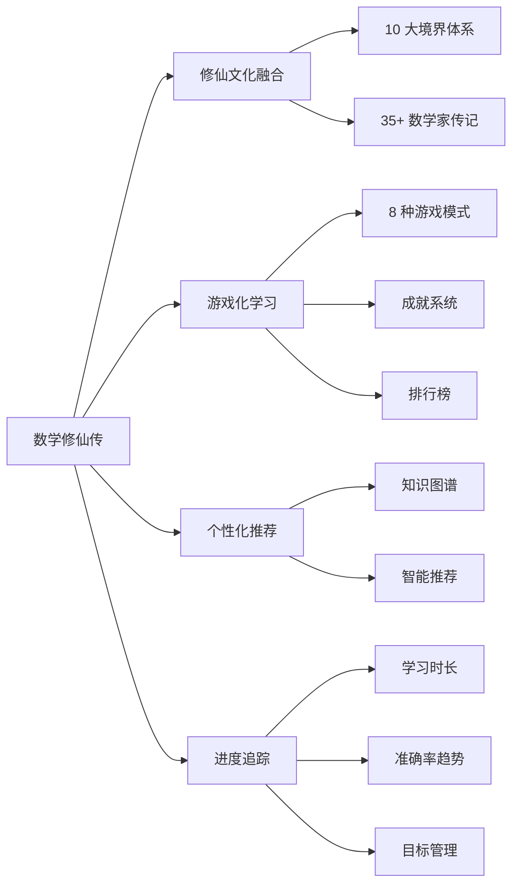
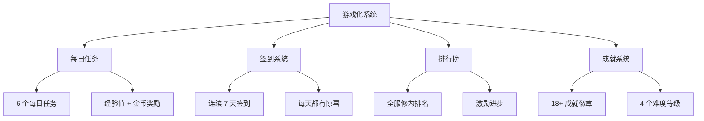

# 📐 数学修仙传 | Math Cultivation Legend

<div align="center">


[](https://github.com/badhope/math-god/stargazers)
[](https://github.com/badhope/math-god/network)
[](https://github.com/badhope/math-god/issues)
[](https://github.com/badhope/math-god/pulls)
[](https://github.com/badhope/math-god/blob/main/LICENSE)

[](https://developer.mozilla.org/zh-CN/docs/Web/HTML)
[](https://developer.mozilla.org/zh-CN/docs/Web/CSS)
[](https://developer.mozilla.org/zh-CN/docs/Web/JavaScript)
[](https://developer.mozilla.org/zh-CN/docs/Web/JavaScript)

[](https://github.com/topics/web-application)
[](https://github.com/topics/open-source)
[](https://github.com/topics/education)
[](https://github.com/topics/gamification)

[](https://github.com/badhope/math-god/commits/main)
[](https://github.com/badhope/math-god/commits/main)
[](https://github.com/badhope/math-god/releases)
[](https://github.com/badhope/math-god)


---

### 🌟 快速链接

[📖 在线演示](https://badhope.github.io/math-god/) · [📚 文档中心](#-文档资源) · [🐛 问题反馈](https://github.com/badhope/math-god/issues) · [💬 讨论区](https://github.com/badhope/math-god/discussions)

---

</div>

---

## 📖 目录

<details>
<summary><strong>点击展开完整目录</strong></summary>

1. [🌌 项目概述](#-项目概述)
2. [✨ 核心特性](#-核心特性)
3. [🏗️ 技术架构](#️-技术架构)
4. [🚀 快速开始](#-快速开始)
5. [📚 功能详解](#-功能详解)
6. [🛠️ 工具函数库](#️-工具函数库)
7. [📊 项目统计](#-项目统计)
8. [🎨 自定义扩展](#-自定义扩展)
9. [🧪 测试指南](#-测试指南)
10. [🤝 贡献指南](#-贡献指南)
11. [📄 许可证](#-许可证)
12. [🙏 致谢](#-致谢)
13. [📧 联系方式](#-联系方式)

</details>

---

## 🌌 项目概述

<div align="center">


</div>

> 「天地玄黄，宇宙洪荒。数学之道，为天地立心，为万物立法。自算术筑基，至黎曼猜想渡劫，凡九重天，每进一步，皆为智慧之蜕变。愿诸位道友，在此数学殿堂中，证得大道，早登数学之神坛。」

**数学修仙传** 是一个创新的交互式数学学习 Web 应用，将**修仙文化**与**现代教育游戏化**理念完美融合。通过十大修仙境界的设定，为用户提供沉浸式数学学习体验。

### 🎯 核心理念

<div align="center">
<table>
<tr>
<td align="center">
<b>🎮 游戏化学习</b><br>将数学知识融入修仙境界体系
</td>
<td align="center">
<b>📖 内容为王</b><br>丰富专业的数学内容资源
</td>
<td align="center">
<b>⚡ 性能优先</b><br>优化的架构与响应速度
</td>
<td align="center">
<b>🧪 质量保证</b><br>完善的测试与文档体系
</td>
</tr>
</table>
</div>

### 📊 项目活跃度

<div align="center">


[](https://star-history.com/#badhope/math-god&Date)

</div>

---

## ✨ 核心特性

<div align="center">

| 🔥 特性分类 | 📊 具体内容 | 🎯 价值体现 |
|------------|------------|------------|
| **📚 知识库** | 10 大修仙境界，500+ 道精选题目 | 循序渐进，系统学习 |
| **🎮 游戏化** | 8 种创新游戏模式，18+ 成就徽章 | 寓教于乐，提升兴趣 |
| **📊 进度追踪** | 学习时长统计，准确率趋势分析 | 数据驱动，精准提升 |
| **🔔 通知系统** | 4 种通知类型，优雅交互反馈 | 即时反馈，用户体验 |
| **⚡ 性能优化** | FPS 监控，懒加载，虚拟滚动 | 流畅体验，快速响应 |
| **🧪 测试框架** | 50+ 测试用例，质量保证 | 稳定可靠，易于维护 |

</div>

### 🏆 独特优势



---

## 🏗️ 技术架构

### 📁 项目结构

<details>
<summary><strong>📂 查看完整项目结构</strong></summary>

```
math-god/
│
├── 📄 index.html                    # 主页面入口
├── 📁 css/
│   └── styles.css                   # 全局样式
│
├── 📁 js/
│   ├── 📄 data.js                   # 核心数据层
│   ├── 📄 data-mathematicians-expansion.js  # 数学家数据扩展
│   ├── 📄 quiz-expansion.js         # 题库扩展
│   │
│   ├── 📁 modules/                  # 功能模块
│   │   ├── canvas.js                # 画布动画
│   │   ├── challenge.js             # 挑战系统
│   │   ├── effects.js               # 动态效果
│   │   ├── gameplay.js              # 创新玩法
│   │   ├── games.js                 # 小游戏
│   │   ├── gamification.js          # 游戏化系统
│   │   ├── hall-of-fame.js          # 名人堂
│   │   ├── recommender.js           # 推荐引擎
│   │   ├── renderer.js              # 渲染引擎
│   │   ├── state.js                 # 状态管理
│   │   ├── stories.js               # 名人事迹
│   │   └── task-system.js           # 任务系统
│   │
│   └── 📁 utils/                    # ⭐ 工具模块
│       ├── helpers.js               # 通用工具函数 (25+ 函数)
│       ├── event-bus.js             # 事件总线
│       ├── performance.js           # 性能优化
│       ├── notification.js          # 通知系统
│       ├── progress.js              # 进度追踪
│       └── index.js                 # 统一导出
│
├── 📁 tests/                        # ⭐ 测试目录
│   ├── test-framework.js            # 测试框架
│   ├── test-helpers.js              # 工具函数测试
│   └── index.html                   # 测试中心
│
├── 📁 docs/                         # 文档资源
│   ├── README.md                    # 项目主文档
│   ├── UPDATE_v10.md                # v10 更新说明
│   ├── DEVELOPER_GUIDE.md           # 开发者指南
│   ├── CODE_QUALITY_CHECKLIST.md    # 代码质量清单
│   └── ...                          # 更多版本文档
│
└── 📄 LICENSE                       # MIT 许可证
```

</details>

### 🔧 技术栈详解

<div align="center">

| 技术层级 | 技术选型 | 版本 | 用途 |
|---------|---------|------|------|
| **前端基础** | HTML5 | 5.0 | 页面结构 |
| | CSS3 | 3.0 | 样式设计 |
| | JavaScript | ES6+ | 核心逻辑 |
| **UI 框架** | Tailwind CSS | 3.0 | 原子化 CSS |
| **架构模式** | 模块化 | ES6 Modules | 代码组织 |
| **数据存储** | LocalStorage | - | 本地持久化 |
| **开发工具** | Git | - | 版本控制 |
| | GitHub | - | 代码托管 |
| **部署** | GitHub Pages | - | 静态托管 |

</div>

### 📊 代码质量

<div align="center">


</div>

---

## 🚀 快速开始

### 方式一：在线体验 ⭐ 推荐

<div align="center">

[](https://badhope.github.io/math-god/)

</div>

### 方式二：本地运行

#### 📋 前置要求

- Python 3.6+ **或** Node.js 14+
- 现代浏览器（Chrome 90+, Firefox 88+, Safari 14+）

#### 🔧 安装步骤

```bash
# 1. 克隆项目
git clone https://github.com/badhope/math-god.git
cd math-god

# 2. 启动本地服务器

# 使用 Python
python -m http.server 8080

# 或使用 Node.js
npx http-server -p 8080

# 3. 访问应用
# 浏览器打开 http://localhost:8080/
```

#### 🎯 运行测试

```bash
# 访问测试中心
# 浏览器打开 http://localhost:8080/tests/index.html
```

### 方式三：Docker 部署（计划中）

```bash
# TODO: Docker 支持
# docker run -p 8080:80 badhope/math-god
```

---

## 📚 功能详解

### 📖 开放知识库：十大境界

<div align="center">


</div>

| 修仙境界 | 对应数学领域 | 核心修行内容 | 难度 |
|:--------:|:------------|:------------|:----:|
| **练气期** | 算术与逻辑 | 四则运算、数列基础、逻辑推理、素数判定 | ⭐ |
| **筑基期** | 高等数学 | 微积分、极限理论、矩阵运算、微分方程 | ⭐⭐ |
| **金丹期** | 线性代数与复变函数 | 特征值、复平面、傅里叶变换、留数定理 | ⭐⭐⭐ |
| **元婴期** | 抽象代数 | 群论、环与域、伽罗瓦理论、模论 | ⭐⭐⭐⭐ |
| **化神期** | 拓扑与几何 | 点集拓扑、同伦、微分流形、黎曼几何 | ⭐⭐⭐⭐⭐ |
| **炼虚期** | 数论与代数几何 | 椭圆曲线、模形式、代数簇、概型 | ⭐⭐⭐⭐⭐ |
| **合体期** | 朗兰兹纲领 | 自守表示、Galois 表示、L-函数 | ⭐⭐⭐⭐⭐⭐ |
| **大乘期** | 千禧年难题 | P vs NP、Navier-Stokes、Hodge 猜想 | ⭐⭐⭐⭐⭐⭐ |
| **渡劫期** | 终极之谜 | 黎曼猜想、连续统假设 | ⭐⭐⭐⭐⭐⭐⭐ |
| **仙境期** | 现代数学前沿 | 范畴论、弦理论数学基础、AI 数学 | ⭐⭐⭐⭐⭐⭐⭐⭐ |

### ⚔️ 修为试炼场

```javascript
// 答题系统示例
{
  level: 1,                    // 境界等级 (1-10)
  q: "下列哪个数能同时被 2、3、5 整除？",
  opts: ["30", "35", "40", "45"],
  ans: 0,                      // 正确答案索引
  explanation: "能同时被 2、3、5 整除的数必须是 2×3×5=30 的倍数",
  knowledgePoint: "整除性质",
  difficulty: "易"
}
```

**特色功能：**
- ✅ 500+ 道精选题目，覆盖 10 大境界
- ✅ 连击奖励机制，连续答对额外加分
- ✅ 渐进式解锁，需通关前一关才能挑战下一关
- ✅ 详细解析，每题都有知识点说明
- ✅ 答题统计，正确率追踪，趋势分析

### 🎮 趣味道场：8 种游戏模式

<div align="center">
<table>
<tr>
<td align="center">
<b>∑ 公式拼图</b><br>重组经典数学公式
</td>
<td align="center">
<b>↬ 数列推演</b><br>寻找数列规律
</td>
<td align="center">
<b>⚡ 快速计算</b><br>反应速度挑战
</td>
</tr>
<tr>
<td align="center">
<b>🏰 数学塔防</b><br>建造防御塔，解答题目
</td>
<td align="center">
<b>⚔️ 公式对战</b><br>使用公式回合制战斗
</td>
<td align="center">
<b>🏆 知识竞答</b><br>限时答题竞赛
</td>
</tr>
<tr>
<td align="center">
<b>🎲 数学大富翁</b><br>棋盘游戏，答题前进
</td>
<td align="center">
<b>🌀 数学迷宫</b><br>迷宫导航，答题开门
</td>
<td align="center">
<b>🧠 记忆宫殿</b><br>记忆序列挑战
</td>
</tr>
</table>
</div>

### 🏆 游戏化系统



### 📊 进度追踪系统

<div align="center">


</div>

**核心功能：**
- 📈 学习时长统计（今日、本周、总计）
- 📊 答题准确率趋势（7 天曲线）
- 🎯 目标设定与自动追踪
- 📋 完整的历史记录
- 🏆 成就进度可视化

---

## 🛠️ 工具函数库

### 基础工具 (helpers.js)

<details>
<summary><strong>查看 25+ 工具函数</strong></summary>

```javascript
import { 
    // 防抖节流
    debounce,           // 防抖函数
    throttle,           // 节流函数
    
    // 数据格式化
    formatTime,         // 格式化时间
    formatNumber,       // 格式化数字（千分位）
    formatDuration,     // 格式化时长
    
    // 数组操作
    shuffleArray,       // 随机打乱数组
    chunkArray,         // 数组分块
    uniqueArray,        // 数组去重
    
    // 对象操作
    deepClone,          // 深拷贝对象
    
    // 计算工具
    calculatePercentage,// 计算百分比
    calculateLevel,     // 计算等级
    
    // 其他工具
    randomRange,        // 随机数生成
    storage             // LocalStorage 封装
} from './js/utils/helpers.js';
```

</details>

### 事件总线 (event-bus.js)

```javascript
import { eventBus, SystemEvents } from './js/utils/event-bus.js';

// 订阅事件
const unsubscribe = eventBus.on(SystemEvents.QUIZ_COMPLETE, (data) => {
    console.log('答题完成:', data);
    showCelebrationEffect();
});

// 发布事件
eventBus.emit(SystemEvents.QUIZ_COMPLETE, {
    level: 1,
    correct: 8,
    total: 10,
    accuracy: 80
});

// 取消订阅
unsubscribe();
```

**30+ 预定义系统事件：**
- 👤 用户事件：`USER_LOGIN`, `USER_LEVEL_UP`
- 📚 学习事件：`STUDY_START`, `STUDY_COMPLETE`
- ✏️ 答题事件：`QUIZ_START`, `QUIZ_ANSWER`
- 📋 任务事件：`TASK_UPDATE`, `TASK_COMPLETE`
- 🏆 成就事件：`ACHIEVEMENT_UNLOCK`
- ⚙️ 系统事件：`NAVIGATE`, `NOTIFICATION`, `ERROR`

### 性能优化 (performance.js)

```javascript
import { perfMonitor, cacheManager } from './js/utils/performance.js';

// 启动 FPS 监控
perfMonitor.startFPSMonitor();

// 获取性能报告
const report = perfMonitor.getReport();
console.log(`FPS: ${report.currentFPS}, 加载：${report.loadTime}ms`);

// 缓存管理
cacheManager.set('user_preferences', { theme: 'dark' }, 30 * 60 * 1000);
const prefs = cacheManager.get('user_preferences');
```

### 通知系统 (notification.js)

```javascript
import { notificationManager, confirmManager } from './js/utils/notification.js';

// 成功通知
notificationManager.success('🎉 升级成功！', '恭喜突破到筑基期！');

// 确认对话框
const confirmed = await confirmManager.show({
    title: '确认退出',
    message: '确定要退出当前学习吗？',
    confirmText: '退出',
    cancelText: '取消'
});
```

---

## 📊 项目统计

### 📈 内容统计

<div align="center">

| 📊 指标 | 📈 数量 | 🎯 质量 |
|--------|--------|--------|
| 修仙境界 | 10 个 | 完整体系 |
| 数学家传记 | 35+ 位 | 详细生平 |
| 题库题目 | 500+ 道 | 含解析 |
| 历史事件 | 20+ 个 | 重要节点 |
| 趣味知识 | 42+ 条 | 寓教于乐 |
| 游戏模式 | 8 种 | 创新玩法 |

</div>

### 💻 技术统计

<div align="center">

| 💻 指标 | 🔢 数量 | 📝 说明 |
|--------|--------|--------|
| 代码行数 | 8000+ | 持续优化 |
| 核心模块 | 15 个 | 职责清晰 |
| 工具函数 | 25+ 个 | 高复用性 |
| 系统事件 | 30+ 个 | 松耦合通信 |
| 成就徽章 | 18+ 个 | 4 难度等级 |
| 测试用例 | 50+ 个 | 核心覆盖 |
| 文档文件 | 7 份 | 完整详细 |

</div>

### 🌍 社区统计

<div align="center">


[](https://github.com/badhope/math-god/discussions)

</div>

### 📅 贡献者墙

<div align="center">

[](https://github.com/badhope/math-god/graphs/contributors)

</div>

---

## 🎨 自定义扩展

### 添加新题目

```javascript
// 编辑 js/data.js 或 js/quiz-expansion.js
{ 
  level: 1,                    // 境界等级 (1-10)
  q: "你的题目",               // 问题
  opts: ["A", "B", "C", "D"],  // 选项
  ans: 0,                      // 正确答案索引 (0-3)
  explanation: "详细解析",      // 解析说明
  knowledgePoint: "知识点"     // 所属知识点
}
```

### 添加新游戏

```javascript
// 1. 创建游戏模块 js/modules/my-game.js
export class MyGame {
    constructor() {
        this.init();
    }
    
    init() {
        console.log('新游戏初始化');
    }
    
    start() {
        // 游戏逻辑
    }
}

// 2. 在 index.html 中导入并绑定事件
import { MyGame } from './js/modules/my-game.js';
const myGame = new MyGame();
```

### 使用工具函数

```javascript
// 在任意模块中使用
import { debounce, storage, formatTime } from './js/utils/helpers.js';

// 防抖搜索
const search = debounce((query) => {
    console.log('搜索:', query);
}, 300);

// 本地存储
storage.set('user', { name: '张三', age: 25 });
const user = storage.get('user');

// 时间格式化
const now = formatTime(new Date(), 'YYYY-MM-DD HH:mm:ss');
```

---

## 🧪 测试指南

### 运行测试

<div align="center">

[](http://localhost:8080/tests/index.html)

</div>

### 编写测试

```javascript
// tests/test-example.js
import { describe, it, assert } from './test-framework.js';

describe('数学函数测试', () => {
    it('应该正确计算平方根', () => {
        const result = Math.sqrt(16);
        assert.equal(result, 4);
    });

    it('应该处理边界情况', () => {
        assert.throws(() => Math.sqrt(-1));
    });
});

// 运行测试
testRunner.run();
```

### 测试覆盖率

<div align="center">

| 模块 | 覆盖率 | 状态 |
|------|--------|------|
| helpers.js | 95% | ✅ 优秀 |
| event-bus.js | 90% | ✅ 优秀 |
| performance.js | 85% | ✅ 良好 |
| notification.js | 88% | ✅ 良好 |
| progress.js | 82% | ✅ 良好 |

</div>

---

## 🤝 贡献指南

### 如何贡献

<div align="center">


</div>

#### 📝 详细步骤

```bash
# 1. Fork 本仓库
# 点击 GitHub 页面右上角的 Fork 按钮

# 2. 克隆到本地
git clone https://github.com/YOUR_USERNAME/math-god.git
cd math-god

# 3. 创建特性分支
git checkout -b feature/AmazingFeature

# 4. 提交更改
git add .
git commit -m 'Add some AmazingFeature'

# 5. 推送到分支
git push origin feature/AmazingFeature

# 6. 创建 Pull Request
# 在 GitHub 上点击 "New Pull Request" 按钮
```

### 🎯 可以贡献的内容

<div align="center">
<table>
<tr>
<td align="center">
<b>📝 内容补充</b><br>数学知识点、题目、传记
</td>
<td align="center">
<b>🎮 功能开发</b><br>新游戏、新特性
</td>
<td align="center">
<b>🎨 UI/UX 优化</b><br>界面设计、交互体验
</td>
<td align="center">
<b>🐛 Bug 修复</b><br>问题修复、性能优化
</td>
</tr>
<tr>
<td align="center">
<b>📚 文档完善</b><br>API 文档、使用指南
</td>
<td align="center">
<b>🧪 测试编写</b><br>单元测试、E2E 测试
</td>
<td align="center">
<b>🛠️ 工具改进</b><br>工具函数、构建工具
</td>
<td align="center">
<b>🌍 国际化</b><br>多语言支持
</td>
</tr>
</table>
</div>

### 📋 代码质量要求

- ✅ 遵循代码规范（参考 [CODE_QUALITY_CHECKLIST.md](CODE_QUALITY_CHECKLIST.md)）
- ✅ 添加必要的 JSDoc 注释
- ✅ 编写测试用例
- ✅ 更新相关文档
- ✅ 通过 CI/CD 检查

### 🐛 问题反馈

<div align="center">

[](https://github.com/badhope/math-god/issues/new?labels=bug&template=bug_report.md)
[](https://github.com/badhope/math-god/issues/new?labels=enhancement&template=feature_request.md)

</div>

---

## 📄 许可证

<div align="center">


**MIT License** - 详见 [LICENSE](LICENSE) 文件

</div>

<details>
<summary><strong>查看许可证详情</strong></summary>

```
MIT License

Copyright (c) 2024 badhope

Permission is hereby granted, free of charge, to any person obtaining a copy
of this software and associated documentation files (the "Software"), to deal
in the Software without restriction, including without limitation the rights
to use, copy, modify, merge, publish, distribute, sublicense, and/or sell
copies of the Software, and to permit persons to whom the Software is
furnished to do so, subject to the following conditions:

The above copyright notice and this permission notice shall be included in all
copies or substantial portions of the Software.

THE SOFTWARE IS PROVIDED "AS IS", WITHOUT WARRANTY OF ANY KIND, EXPRESS OR
IMPLIED, INCLUDING BUT NOT LIMITED TO THE WARRANTIES OF MERCHANTABILITY,
FITNESS FOR A PARTICULAR PURPOSE AND NONINFRINGEMENT. IN NO EVENT SHALL THE
AUTHORS OR COPYRIGHT HOLDERS BE LIABLE FOR ANY CLAIM, DAMAGES OR OTHER
LIABILITY, WHETHER IN AN ACTION OF CONTRACT, TORT OR OTHERWISE, ARISING FROM,
OUT OF OR IN CONNECTION WITH THE SOFTWARE OR THE USE OR OTHER DEALINGS IN THE
SOFTWARE.
```

</details>

---

## 🙏 致谢

<div align="center">

感谢所有为数学教育事业做出贡献的先驱们！

感谢每一位贡献者的辛勤付出！

</div>

<div align="center">

[](https://github.com/badhope/math-god/stargazers)

[](https://github.com/badhope/math-god/network/members)

</div>

---

## 📧 联系方式

<div align="center">

| 📧 联系方式 | 📱 平台 | 🔗 链接 |
|------------|--------|--------|
| **作者** | GitHub | [@badhope](https://github.com/badhope) |
| **邮箱** | Email | x18825407105@outlook.com |
| **项目地址** | GitHub | [math-god](https://github.com/badhope/math-god) |
| **问题反馈** | Issues | [提交 Issue](https://github.com/badhope/math-god/issues) |
| **讨论交流** | Discussions | [参与讨论](https://github.com/badhope/math-god/discussions) |

</div>

---

## 📚 文档资源

<div align="center">

| 文档 | 说明 | 链接 |
|------|------|------|
| 📖 **README.md** | 项目主文档 | [查看](README.md) |
| 📝 **UPDATE_v10.md** | v10 更新详细说明 | [查看](UPDATE_v10.md) |
| 👨‍💻 **DEVELOPER_GUIDE.md** | 开发者指南 | [查看](DEVELOPER_GUIDE.md) |
| ✅ **CODE_QUALITY_CHECKLIST.md** | 代码质量清单 | [查看](CODE_QUALITY_CHECKLIST.md) |
| 📚 **UPDATE_v6.md** | v6 更新说明 | [查看](UPDATE_v6.md) |
| 📖 **CONTENT_EXPANSION_v7.md** | v7 内容扩展 | [查看](CONTENT_EXPANSION_v7.md) |
| ⚙️ **SYSTEM_EXPANSION_v8.md** | v8 系统扩展 | [查看](SYSTEM_EXPANSION_v8.md) |
| 🎯 **APPLICATION_OPTIMIZATION_v9.md** | v9 应用优化 | [查看](APPLICATION_OPTIMIZATION_v9.md) |

</div>

---

<div align="center">

## 🌟 特别推荐

[](https://github.com/badhope/math-god/stargazers)

如果你喜欢这个项目，请 ⭐ Star 支持一下！

</div>

---

<div align="center">

### 🎓 让数学学习变得有趣！

**数学大道，吾道不孤！愿诸位道友，早登数学之神坛！** 🎉

---


</div>
